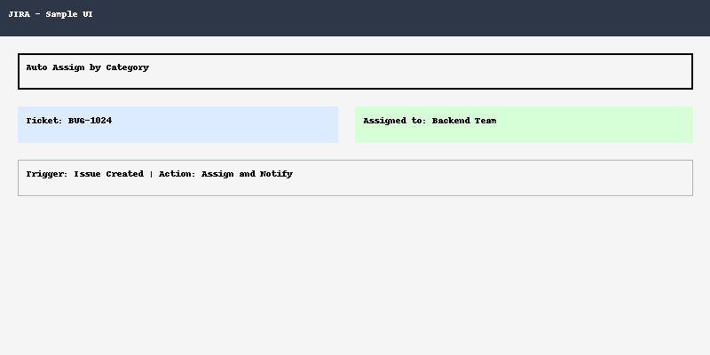
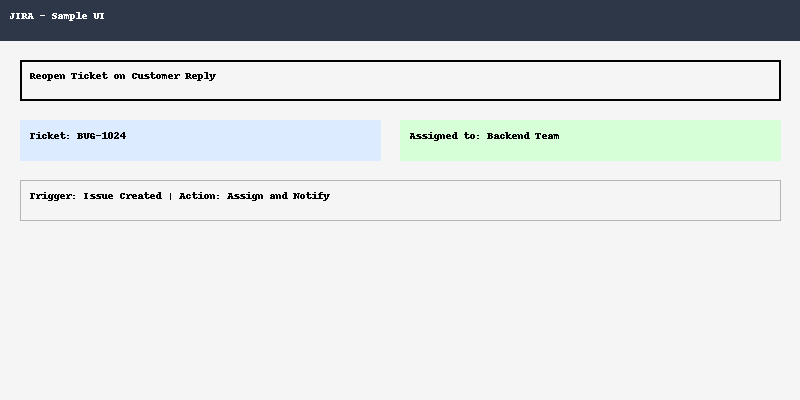
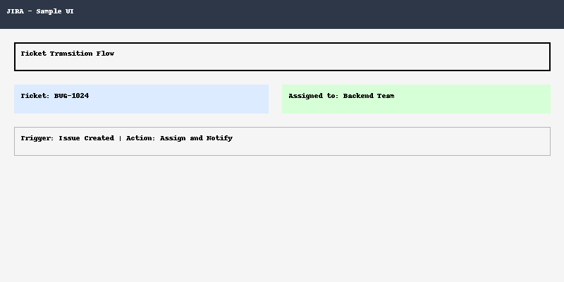

# 🧠 JIRA Automation Samples

Boost your support team's productivity with smart, no-code JIRA automation.  
This repository demonstrates all automations use **native JIRA features**, no plugins or paid tools.

---

## 📌 What's Included

📁 `rules/`  
JSON automation rules you can import directly into your JIRA instance.

📁 `templates/`  
Ready-to-use Confluence documentation and rule breakdown templates.

📁 `screenshots/`  
Dummy visual guides to simulate dashboards and workflows.

📄 `LICENSE`  
MIT License — open to use and extend freely.

---

## 📂 Internal Project Background

This JIRA Automation framework was developed during my time at **Fizyr (Netherlands)** as an internal support optimization initiative:

- ✅ **Company:** *Fizyr, Netherlands*  
- 🧠 **Goal:** Improve ticket workflows and team response time through logic-based JIRA automation — without using paid plugins  
- 🛠️ **Scope:** Developed rule-based flows, reusable templates, and process documentation tailored for support and engineering teams

It is now open-sourced for other teams facing similar JIRA inefficiencies and looking for plug-and-play solutions.

---

## 🚀 Key Automations

- 🔁 Auto-assign tickets by category or support level
- 🔄 Auto-transition statuses via keywords
- 🔔 SLA alerts to Slack/email when breached
- ⏳ Flagging aging or high-priority issues
- 🔃 Reopening tickets upon customer comments
- 📊 Dashboard tagging for executive visibility

---

## 📸 Visual Preview

### 🔧 Auto Assignment Rule

### 📊 Jira Dashboard Sample

### 🔔 Priority Notification Flow

### 💬 Reopen on Reply

### ⏱️ SLA Tracking Dashboard

### 🎯 Support Level Assignment

### 🔁 Ticket Transition Flow

---

## 👤 Who Should Use This?

- Tech support & NOC engineers  
- DevOps teams using JIRA  
- Project managers looking to reduce SLA risk  

---

## 📰 Related Articles

📘 **Dev.to Post**  
🔗 [From Chaos to Clarity – My Lightweight JIRA Automation Framework (No Plugins, Just Logic)](https://dev.to/aroojjaved93/from-chaos-to-clarity-my-lightweight-jira-automation-framework-no-plugins-just-logic-2deg)

📘 **Medium Article**  
🔗 [Boosting Productivity with No-Code JIRA Automation – Real-World Samples for Every Team](https://aroojjaved93.medium.com/boosting-productivity-with-no-code-jira-automation-real-world-samples-for-every-team-25c7a126cdde)

📘 **Hashnode Blog**  
🔗 [How I Automated JIRA Without Plugins](https://aroojtech.hashnode.dev/from-chaos-to-control-how-i-automated-jira-workflows-for-a-smarter-support-system)

📘 **Zenodo Journal**  
🔗 [SLA Report Journal @ Zenodo](https://doi.org/10.5281/zenodo.15722071)

---

## 🧠 Author

**Arooj Javed**  
Support Engineer | Automation Enthusiast | Workflow Optimizer  
🔗 [GitHub](https://github.com/arooj-javed) | [Blog](https://hashnode.com/@aroojjaved93)

---

## 📄 License

This project is licensed under the [MIT License](LICENSE).

Feel free to fork, use, or adapt for your technical teams.

---

🙌 Support This Project

If you find this project helpful, please consider giving it a ⭐ on GitHub!

Your star helps others discover this project and motivates continued improvements! 💡

